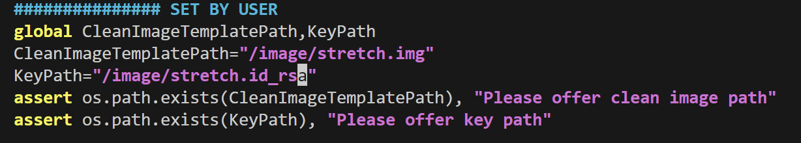
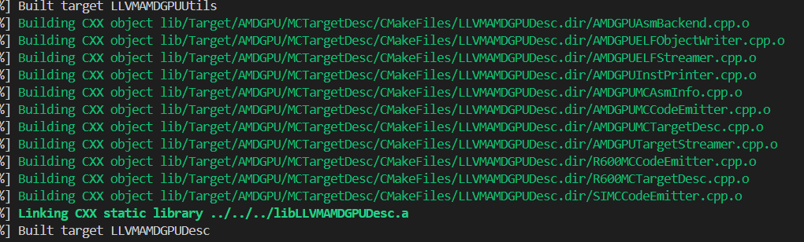

# 复现工作

[https://github.com/seclab-fudan/SyzDirect](https://github.com/seclab-fudan/SyzDirect)

## General Use

```jsx

# 设置一下uptime和fuzz-rounds就可以了
$ python Main.py -h
usage: Main.py [-h] [-WorkdirPrefix WORKDIRPREFIX] [-dataset DATASET_FILE] [-j J] [-fuzz-rounds RUN_ROUNDS] [-uptime UPTIME]
               [-linux-repo-template LINUX_TEMPLATE]
		[prepare_for_manual_instrument/prepare_kernel_bitcode/analyze_kernel_syscall/extract_syscall_entry/instrument_kernel_with_distance/fuzz]
...... 

This is the runner script for Syzdirect.

positional arguments:
  prepare_for_manual_instrument/prepare_kernel_bitcode/analyze_kernel_syscall/extract_syscall_entry/instrument_kernel_with_distance/fuzz
                        actions to be chose from

optional arguments:
  -h, --help            show this help message and exit
  -WorkdirPrefix WORKDIRPREFIX
                        working directory root, default set to cwd/workdir
  -dataset DATASET_FILE
                        input dataset for datapoints, default set to ${WorkdirPrefix}/dataset.xlsx
  -j J                  cpu num to use
  -fuzz-rounds RUN_ROUNDS
                        run rounds for every case
  -uptime UPTIME        fuzzing timeout(hours) for every case, default set to 24
  -linux-repo-template LINUX_TEMPLATE
                        linux repository template can also be given to save time cloning Linux repository
```

## 步骤一：Image

在syzdirect/Runner/Config.py -> PreparePathVariables() 相关位置填好路径

############### SET BY USER
global CleanImageTemplatePath,KeyPath
CleanImageTemplatePath=""
KeyPath=""
assert os.path.exists(CleanImageTemplatePath), "Please offer clean image path"
assert os.path.exists(KeyPath), "Please offer key path"

如下图，填写img路径



## 步骤二：插桩准备

```jsx
//这里我改用了python3
pip3 install pandas openpyxl Levenshtein tqdm
apt install cmake libboost-all-dev golang

//使用root用户 这一步需要花很长时间
cd syzdirect/Runner && python Main.py prepare_for_manual_instrument

```



构建成功


### 错误解决

**错误1**


和llvm相关，设备上原先有另一个版本的llvm，可能是发生了冲突

**错误2**


解决方法：

在syzdirect_function_model下的cmakelist文件中加入行，指定llvm工具链的路径，**此问题可以解决问题1**

估计是开发人员主机上安装了LLVM，没有考虑到这一个问题

```jsx
#此路径下需要包含LLVMConfig.cmake文件
set(LLVM_DIR /home/mei/Desktop/SyzDirect/source/llvm-project-new/build/lib/cmake/llvm/) 
find_package(LLVM REQUIRED CONFIG)
```

错误3

syzkaller编译报错，这个问题需要看一看了，这个问题暂时没有找到合适的解决办法，但是不影响


将syzdirect_fuzzer sys/sys.go中除了Linux的内容注释掉。同时删除掉目录里面的这些部分


## 步骤三：手动插装打patch

1、打kcov.diff，syzdirect提供的补丁可能不适配6.0+版本的linux源码，需要手动进行修改


```jsx
在workdir/srcs
git apply ../../../kcov.diff
```

2、这里还需要手动将kcov_mark_block(xidx)代码插入到目标basicblock中，这里的作用就是将fuzzing导向插装位置达到定向的效果，因此需要斟酌插桩的位置，可以在同一个linux内核的不同位置插入多个桩，注意xidx的编号要不同。

插桩的方法就是加一个头文件，并在相关行加一行代码

```go
#include <linux/kcov.h>

kcov_mark_block(0);
```


## 步骤四：生成bitcode并对系统调用进行分析

```jsx
python3 Main.py prepare_kernel_bitcode analyze_kernel_syscall extract_syscall_entry 
```

**prepare_kernel_bitcode**

```jsx
apt install golang bison flex libboost-dev libelf-dev
```

### 错误解决

错误1

可能会出现unknown compiler的错误

将Runner\workdir\srcs\case_0\scripts\Kconfig.include中的43行改为clang的地址即可


错误2

出现symbolizer不见了的问题，这可能是由于编译的内核版本比较新，syzdirect在进行静态分析时会出现一些错误，暂时没有很好的解决办法，只能删掉对应的llbc文件，文件路径可参考如下

```go
rm workdir/bcs/case_0/net/netlink/af_netlink.llbc
rm workdir/bcs/case_0/fs/binfmt_misc.llbc  
rm workdir/bcs/case_0/drivers/xen/privcmd.llbc
```


错误3

在extract_syscall_entry的步骤中可能出现部分插装位置不可达的情况，这种情况要剔除不可达的插装代码，并重新执行整个编译静态分析流程

```go
# 删除bzImage，syzdirect工具会检查bzImage是否存在，要重新编译源码得先删除bzImage
rm workdir/bcs/case_0/arch/x86/boot/bzImage
# 这个目录下保存了静态分析生成的结果，syzdirect也会检查是否存在，要重新进行静态分析就要先删除
rm -rf workdir/interfaces workdir/tpa

python3 Main.py prepare_kernel_bitcode analyze_kernel_syscall extract_syscall_entry 

```

## 步骤五：将距离信息插桩到内核，开始模糊测试

上述步骤的报错都解决以后，就可以编译生成插入了distance信息的源码，并进行fuzz

```jsx
python3 Main.py instrument_kernel_with_distance 
# 设置每个case跑一轮，时长4h
python3 Main.py -fuzz-rounds 1 -uptime 4 fuzz

#会收集case_0的所有fuzzing结果，并保存为result.xlsx文件，要收集其他case，改一下路径就可以
python3 collect_result.xlsx
```

## docker容器复现环境

环境基于ubuntu 20.04

```go
docker pull apowerfulmei/syzdirect:v1
# 找一个合适的localpath挂载
docker run --name syzdirect -v localpath:/Syzdirect -it --privileged apowerfulmei/syzdirect:v1

# 容器内部，编译好的syzdirect工具保存在了/syz-source目录下，需将其移动到/Syzdirect
cp -r /syz-source /Syzdirect
```

需要人工完成的内容

```go
# 源码放置目录，一个case_0对应一个linux源码
source/syzdirect/Runner/workdir/srcs/case_0/

# 对源码完成步骤三中的手动插装与打kcov patch部分，随后即可直接从步骤四的编译静态分析开始
syzdirect提供的kcov.diff需要做适应性调整
syz-source/source/syzdirect/kcov_6下面有6.0+打好patch的kcov.h和kcov.c，直接替换到源码里的对应文件应该也可以 

# 修改dataset.xlsx文件，具体内容在下面
```

一个case（即一个linux源码上）上可设置多个目标，在多个位置进行插装

如果需要多份不同版本的linux源码，则需要分别将源码放置在case_0 case_1 case_2 ….下，并且需要修改source/syzdirect/Runner/dataset.xlsx文件，在其中加入相应的信息

| idx | repro bug title | kernel commit | recommend syscall | config path |
| --- | --- | --- | --- | --- |
| 0 1 2 3编号 | 目标bug的title | 内核的commit | 空 | 内核编译config path |
| required | 不重要 | 如果需要的话可以写上去，不重要，实际编译以你放在srcs下的源码为准 | 不重要 | required |